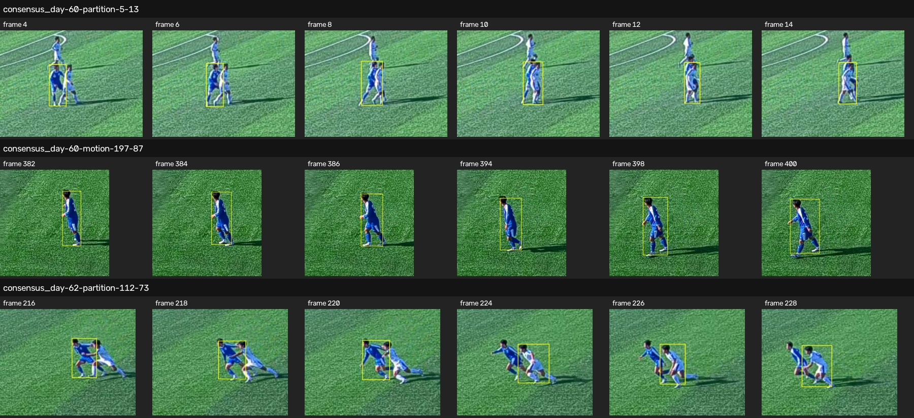

# Birleşik kimlik adayı: 19 bilinen kesit

9 Ekim 2026. Kısa kopma araştırması, önceki uzlaşı kontrolünün gündüz 60/62
ve gece 80/82 kesitleri eklenerek **19 tüketilmiş kesite, 7.125 örneğe**
genişletildi. Bunların tamamı geliştirme verisidir. Yeni bağımsız kontrol
açılmadı; canlı takip motoru veya uygulamanın varsayılanı değiştirilmedi.

## Genişletme hangi sorunu yakaladı?

Kısa kopma/palet adayı tek başına önceki altı doğru kimlik ayrımının yalnız
birini koruyordu. Seyrek kişi çifti puanlarının gerilememesi, bu sınırların
korunduğunu kanıtlamıyordu. Eski görünüş/palet uzlaşısını da uygulayan birleşik
aday, iki yöntemin kaynak kanıtlarını birlikte kullanır; ikisi aynı değişimi
onaylarsa tek kimlik ayrımı oluşturur.

İlk birleşik ölçümde altı ayrımdan ikisi yine kayboldu: gündüz 62'de 112 ve
137. örnekler. Nedeni ölçümdeki veri aktarımıydı: eski görünüş koşuluna,
başlangıç akışının kesitte hesapladığı renk merkezleri yerine sabit renk
çapaları verilmişti. Başlangıç merkezleri yaklaşık `91/131/182` ve
`167/191/238`; sabit çapalar `120/150/188` ve `205/217/236` idi. Aynı
görüntülerde bunlar aynı karar girdisi değildir.

Son arayüz bu girdileri ayrı ister: `palette_anchors` sabit çapaları,
`baseline_centers` özgün başlangıç akışının merkezlerini taşır. İkincisi
yalnız başlangıçtaki renk geçmişi ve uygun takipler üzerinden hesaplanır;
her kaynak gözleminin eski takım atamasıyla eşitliği denetlenir. Hareket
onarımı veya kimlik ayrımı sonrasında renk kümeleri yeniden öğrenilmez.

Başarısız ilk ölçüm ve kod kopyaları korundu. Onun tamamlanmış ikinci-motor
çıktıları kaynak/model/kod hashleri doğrulanarak son ölçümde kullanıldı;
başarısız kimlik kararları doğru etiketler gibi kullanılmadı.

## Sonuç ve kabul kapıları

| Ölçü | Sonuç |
|---|---:|
| Kesit / örnek | 19 / 7.125 |
| Korunan başlangıç gözlemi | 144.623 / 144.623 |
| Eklenen kaynak tespiti | 63 |
| Son çıktı gözlemi | 144.686 |
| Kaybolan eski kutu / değişen eski forma kararı | 0 / 0 |
| Kullanılan hareket önerisi / üretilen öneri | 16 / 18 |
| Toplam kimlik ayrımı | 8 |
| Korunan eski doğru ayrım | 6 / 6 |
| Beyaz 6'nın yanlış bölünmesinin reddi | Korundu |

Eski gece 50 kesitindeki iki hareket önerisi, bir başlangıç kutusu kaybolacağı
için yine bütün kesit düzeyinde geri çekilir. Yeni kutu kazanımı eski kutu
kaybını telafi etmiş sayılmaz. Eklenen 63 kutunun tamamının bağımsız gerçek
kişi doğrulaması yapıldığı iddia edilmez.

Önceki kısa kopma ölçümündeki iki aynı-kişi bağlantısı ve bir yanlış birleşme
düzeltmesi korundu. Ek dört kesitte seyrek kişi çifti puanı artmadı. Sekiz
kaynak grubunda başlangıca, eski palet yöntemine ve kısa kopma adayına göre
eski doğru ilişkiler/kapsam ve forma ölçümleri gerilemedi.

Altı doğru ayrım ile beyaz 6 için ayrımın iki yanındaki özgün kutular
karşılaştırılır. Takip numarası yeniden atanmış olsa da aynı kaynak gözlemi
aranır. Eksik gözlem, yeniden birleşme veya beklenmeyen bölünme kabul
kapısını düşürür. Bunlar genel puan toplamından ayrı koşullardır.

Eski palet yönteminin yeniden kurulması da ayrıca denetlendi: önceki 15
kesitte **112.852 gözlemin kimlikleri, kutuları, güvenleri, zamanları ve
gözlem bazındaki takımları birebir eşleşti**. Bu, yalnız altı seçili sınırın
korunmasına dayanan bir eşitlik iddiası değildir.

Ek dört kesitteki bütün seçilmiş müdahaleler kaynak şeritlerinde incelendi:
üç eski ayrım ve iki yeni hareket onarımı. Gündüz 60'ta yalnız yürüyen mavi
oyuncunun, gece 80'de topa yaklaşıp vuran kırmızı kalecinin kısa aralığı
aynı görünür kişide sürüyor. Üç ayrımda iki farklı forma taşıyan kişi
görüntüde ayrı görülüyor. Örtüşme anının kusursuz kare sınırı veya sonraki
bütün kimliklerin doğruluğu bu yerel incelemeden çıkarılmaz.



Kaynak: SoccerTrack v2, Atom Scott ve diğerleri; mevcut veri kümesinin
CC BY 4.0 lisansı kapsamında kırpılmış/ölçeklenmiş görüntüler ve takip kutuları.
[Veri kaynağı ve lisans kaydı](KIMLIK-UZLASISI-SONUCLARI.md).
Gece kalecisi ve diğer gündüz ayrımı, ikinci inceleme şeridinde kayıtlıdır.

## Doğrulama ve tekrar

58 ilgili test geçti; bunların 16'sı yeni birleşim/kaynak sözleşmesi
testidir. Sıkıştırılmış yedi gerçek kaynak geçmişi, altı doğru ayrımı ve
beyaz 6 örneğini kalıcı testlere taşır. Bunlar tam takip başlatma veya
bağımsız yeni görüntü testi değildir; ayrım mantığını özgün gözlem geçmişiyle
sınar. Önceki tam başlangıçlı kısa kopma testleri ayrıca geçer.
Ruff ve 564 kaynak dosyasında mypy başarılıdır. Son PR başında bütün CI
işleri ayrıca çalışır.

19 kesitin ikinci-motor kanıtının ilk 15'i önceki tamamlanmış kaynak
tekrarından gelir; ek dört kesitte gerçek kaynak RGB ve OSNet yeniden
çalışmıştır. Son karar tekrarı, tamamlanmış 19 kesitlik koşunun doğrulanmış
ikinci-motor çıktılarını kullanır. Sabit dedektör kutuları önbellektendir;
yeni dedektör çıkarımı veya gerçek zaman hız başarısı iddia edilmez.

```powershell
.\venv-cv\Scripts\python.exe -m scripts.soccertrack_v2.benchmark_guarded_identity --out .cache/guarded-new-run
.\venv-cv\Scripts\python.exe -m pytest --noconftest -q tests/test_short_gap_motion.py tests/test_short_gap_replay_cache.py tests/test_guarded_identity.py
```

`--secondary-report <tamamlanmış-rapor>` yalnız kaydı, kaynakları, modeli,
sürümleri ve kullanılan çıktı hashleri doğrulanan ikinci-motor kanıtını
tekrar kullanır. Eski ölçümün sürücü hashleri kendi raporunda kalır. Eksik
bir rapor tamamlanmış tekrar gibi kabul edilmez.

- [Son 19 kesit ölçümü](measurements/identity-guarded-development-20261009.json)
- [İlk ölçüm ve ek dört kesitin kaynak çıkarımı](measurements/identity-guarded-initial-replay-20261009.json)
- [Kabul kapıları, başarısızlık nedeni ve eski çıktılarla eşitlik](measurements/identity-guarded-decision-20261009.json)
- [Beş müdahalenin kaynak incelemesi](measurements/identity-guarded-source-review-20261009.json)
- [Kaynak testlerinin kapsamı](../tests/fixtures/guarded-identity-source-notes.md)

## Kalan iş

Aday hâlâ çevrimdışı araştırma bileşenidir. Video ve canlı segment akışları,
başlangıç takım/kutu kanıtını taşımalı; hareket onarımı ve bağımsız takip
desteği aynı kaynaklarla çalışmalı; gecikmeli ayrım çıktı/DB aktarımında
aynı sonucu üretmelidir. Bundan sonra aday kodu, model, parametreler ve
kabul planı dondurulup yeni bağımsız kontrol açılabilir.

Tek AI ile yapılmış seyrek kaynak incelemesi, bağımsız insan hakem, tam maç
IDF1/HOTA veya kadro kimliği başarısı değildir. Kalan gece forma hataları,
kısmi/mükerrer kutular, kesitler arası süreklilik, top/olay doğruluğu ve
gerçek zaman hedefleri bu geliştirme sonucu ile tamamlanmış sayılmaz.
