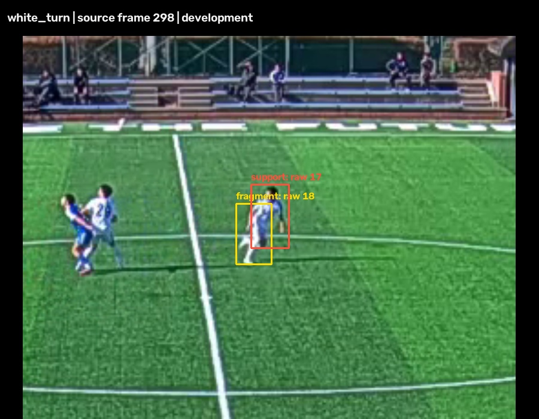
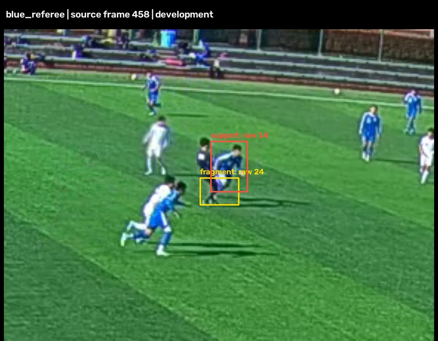

# İki gündüz kimlik kopmasının tanısı

19 Eylül 2026. İki hata kaynak görüntü ve tam tespit geçmişiyle yeniden üretildi.
Sorun yalnız ReID değildir: görünüş kapalı Deep OC-SORT kolu da iki bağlantıyı
kaybediyor. Bu çalışma hata tanısı ve regresyon girdisi teslim eder; üretim
doğruluğunun düzeltildiği veya yeni bir motorun onaylandığı anlamına gelmez.

## Beyaz koşucu: parçalı kutular ve hareket eşiği

0 numaralı kesitte 280→310 kareleri aynı beyaz oyuncudur. 298. karede üst gövde
`raw 17`, kaymış alt gövde `raw 18` olarak ayrı ayrı tespit edilmiş. Takip 9
alt gövdeyi alırken baş/üst-gövde adayının hareket tahminiyle IoU'su **0,2123**, gerekli
eşik **0,3**. Üst-gövde adayı geometrik kapıdan geçemiyor. 310. karede kişi 175 oluyor.

Yalnız `raw 18` çıkarıldığında da eski kimlik korunmuyor. Bu tanı kopyasında
aynı zamanda eşik 0,2 yapılınca bağlantı korunuyor. Yalnız eşiği 0,2 yapmak
ise başarısız: sonuç kimliği 146. Bu, tek başına eşik değiştirmenin çözüm
olmadığını gösterir. Ani yön/hız değişimi ve tespit kutusunun değişmesi
birlikte ele alınmalı; bu iki örnekten genel eşik seçilemez.

## Mavi oyuncu: hakemle karışan alt gövde

3 numaralı kesitte 440→460 kareleri aynı mavi oyuncudur. 458. karede hedefe ait
`raw 14` kutusu **0,4745** IoU ile zaten kapıdan geçiyor. Küçük `raw 24` kutusu
**0,4285** IoU ile eski takip 146'ya, hedef gövdesi mevcut rakip takip 152'ye
atanıyor. Bu olay beyaz koşucudaki eşik reddiyle aynı değildir.

Yakın planda küçük kutu oyuncu/hakem bacaklarını karıştırıyor; tek kişiye ait
kesin bir mükerrer kutu diye etiketlenmedi. Yalnız bu karışık kutuyu tanı
kopyasından çıkarmak kimlik bağlantısını koruyor. Bu sonuç otomatik silme
kuralına izin vermez: benzer geometride gerçek ikinci oyuncu/hakem bulunabilir.

## Nedensel karşılaştırma — hareket kolu

| Müdahale | Beyaz 280→310 | Mavi 440→460 |
|---|---|---|
| Özgün kod / IoU 0,3 | 9→175, kopuk | 146→152, kopuk |
| Yalnız IoU 0,2 | 9→146, kopuk | 130→136, kopuk |
| Yalnız elle işaretli kutuyu çıkar | 9→175, kopuk | 146→146, korunuyor |
| Elle işaretli kutuyu çıkar + IoU 0,2 | 9→9, korunuyor | 130→130, korunuyor |

Kolların ID değerleri karşılaştırma etiketi değildir; her kolda aynı kaynak
kutularındaki iki uç noktanın ilişkisidir. "Elle işaretli kutuyu çıkar" kolları
oracle tanısıdır: olayın karesini ve kutusunu önceden bilen müdahaleler üretime
alınmadı. Önceki OSNet kolunda da iki uç bağlantı kopuktu; buradaki müdahaleler
OSNet ile yeniden ölçülmedi ve ReID doğruluk kazanımı olarak sunulamaz.

## Tekrarlanabilirlik ve testler

- Kaynak videolar, eski tespitler, etiketler ve üretim kodu değişmedi.
- İki sıkıştırılmış JSON girdisi 0. kareden başlayan toplam **407 örnek kare**
  içerir. Sadece hata penceresinden başlatıp farklı Kalman geçmişi üretmez.
  Görüntü, etiket ve özgün tespit SHA-256 değerleri girdide kayıtlıdır.
- 17 test tam geçmişi, kaynak kutu ve dosya hash'i eşleşmesini, bozuk girdinin reddini, iki
  ayrı hata nedenini ve oracle müdahalesinin kaynak veriyi değiştirmemesini
  denetler. Başarılı testler üretim hatalarının çözüldüğü anlamına gelmez.
- CI gerçek takip algoritmasıyla yeni test dosyasını ayrı süreçte çalıştırır;
  GPU ve model indirmesi gerekmez. Kaynak kodu ve girdi hash'leri koşu başında
  ve sonunda karşılaştırılır.
- Yakın plan klipler kaynak 25 FPS'te, görüntü oranı korunarak üretildi.
  Çalıştırma: `python -m scripts.soccertrack_v2.audit_identity_failures --video --out .cache/<yeni-klasor>`.
  `--prepare-fixtures` yalnız ilk üretim içindir; mevcut test girdisini ezmez.

Makine raporu: `measurements/identity-failure-audit-results.json`. Ayrıntılı
karar izi `.cache/identity_failure_audit_v3/report.json` içinde; hash'i raporludur.

## Geliştirme kararı

Genel IoU eşiği düşürülmedi ve kare numarasına bağlı özel kural eklenmedi.
Bir sonraki üretim adayı, parçalı/karışık kutunun eski kimliği ele geçirmesini
önlerken temas eden gerçek ikinci kişiyi korumalı. Hareket kapısının esnemesi
yalnız güvenilir bütün-gövde ve kimlik kanıtıyla değerlendirilmelidir. Bu iki
regresyon gerekli fakat yeterli değildir: tüm 11 geliştirme kesitinde kişi,
forma ve kapsam kapıları geçilmeden yeni kontrol görüntüleri açılmayacak.
