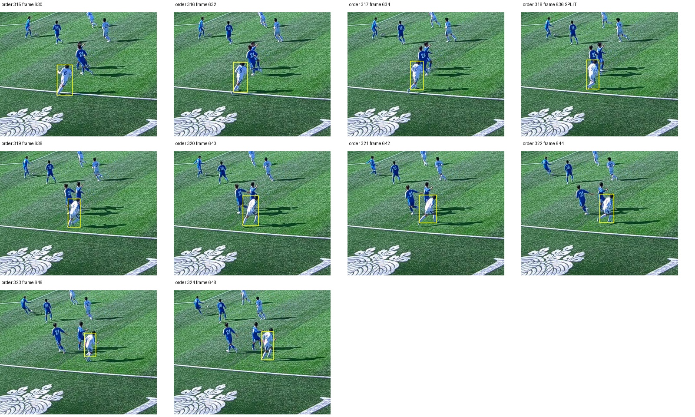

# Kimlik uzlaşısı kontrol sonucu

19 Eylül 2026. **Aday varsayılan kullanım için reddedildi.** Dört yeni kesitte
seyrek etiket puanları korunmasına rağmen bütün yeni ayrımların görüntü denetimi,
aynı beyaz 6 numaralı oyuncunun gereksiz bölündüğünü gösterdi. Mevcut varsayılan
ByteTrack korunur; `consensus` deneysel açık seçim olarak kalır.

## Kontrolün sırası ve kapsamı

Kod/model/kalibrasyon/çapa/parametre ve değerlendirme araçları `7166507` ile
görüntüler açılmadan sabitlendi. Plan: [kontrol protokolü](KIMLIK-UZLASISI-KONTROL-PLANI.md).
Gündüz 117093 kesit 60/62 ve gece 117092 kesit 80/82, toplam 120 saniye kullanıldı.
Bunlar geliştirme maçlarının farklı zamanlarıdır; bağımsız yeni maç değildir.

374/686 başlangıç karelerindeki 270 tespit kutusunun tamamı kaynak görüntüden
incelendi. 404/716 uçları ve önceden belirlenen bağlam şeritleriyle 160 aynı kişi
ve 160 farklı kişi bağı kuruldu. 57 kişi olmayan kutu, 33 belirsiz örnek ve
bitişte görünür olup ayrı kaynak kutusu bulunmayan 20 kişi ayrıca kayıtlıdır.
Etiketler aday tahminleri açılmadan `27e7800` commit'inde SHA256 ile sabitlendi.
İnceleyici tek Codex görsel değerlendiricisidir; insan hakem doğrulaması yoktur.

Karışık kutuya tek kişi etiketi zorlanmadı. Kişi açıkça izlenebiliyorsa yalnız
üst gövdeyi kapsayan uç kutusu aynı kişi bağına dahil edildi; bu kısmi kapsam
not edildi. Belirsiz başlangıçlara uydurma bir uç kutusu bağlanmadı; bunlar
`source_review` içinde sayıldı. Tam maç HOTA/IDF1 veya kadro kimliği ölçülmedi.

## Aynı tespitlerdeki karşılaştırma

| Ölçü | Gündüz: mevcut / aday | Gece: mevcut / aday |
|---|---:|---:|
| Doğru forma | 70 / 70 | 43 / 43 |
| Yanlış forma | 10 / 10 | 5 / 5 |
| Atanamayan forma | 14 / 14 | 9 / 9 |
| Eksik forma kutusu | 14 / 14 | 1 / 1 |
| Başka giysiye takım atama | 7 / 7 | 2 / 2 |
| Doğru aynı kişi bağı | 80/102 / 80/102 | 54/58 / 54/58 |
| Doğru farklı kişi bağı | 71/102 / 71/102 | 56/58 / 56/58 |
| Seyrek çiftlerde yanlış bölünme | 1 / 1 | 3 / 3 |
| Çelişkili forma taşıyan kimlik | 0 / 0 | 1 / 1 |

Atanamayan ve eksik kutu ölçüleri örtüşür; toplanmaz. Kapsanmayan çiftler başarı
sayılmaz. Kaynak bazındaki önceden belirlenen seyrek gerileme kapıları boş çıktı.
Toplam 30.021 gözlemde kutu, güven, zaman ve takım atamaları birebir aynı kaldı.

## Bütün yeni kimlik ayrımları

| Kesit / ilk örnek sırası | Kaynak görüntü kararı |
|---|---|
| Gündüz 60 / 5 | Maviden beyaza kişi devrini ayırıyor. |
| Gündüz 60 / 318 | **Yanlış bölünme:** beyaz 6 numara önce ve sonra aynı kişi. |
| Gündüz 62 / 112 | Maviden beyaz 8 numaraya kişi devrini ayırıyor. |
| Gündüz 62 / 137 | Beyaz 29'dan mavi 9'a kişi devrini ayırıyor. |
| Gece 80 ve 82 | Yeni ayrım yok. |

Üç olumlu ayrım bir yanlış bölünmeyi telafi etmiş sayılmaz. Örtüşme geçişlerinde
tam kare düzeyinde kusursuz sınır iddia edilmiyor. Seyrek puanların değişmemesi,
etiketlerin dışındaki yeni hatanın yokluğu anlamına gelmedi; tüm ayrımları
inceleme şartı bu hatayı yakaladı. Kontrol bu aday için kapandı. Bu görüntülerde
yeniden ayar yapıp aynı kontrolü başarı kanıtı olarak kullanmak yasaktır.

Görseller ve kararlar: [tam sınır denetimi](measurements/identity-consensus-control-boundary-review.json).
Örnek yanlış bölünme:

## Gerçek dedektör ile hız

RTX 5060 Laptop, Torch, RF-DETR small, dört görüntü parçası ve top ROI ile eski
geliştirme kesiti 3'ün ilk 10 saniyesi ölçüldü. Önizleme ve DB yoktur. Her motor
iki kez aynı dedektör nesnesiyle çalıştı; kendi tekrarlarının JSON çıktıları
birebir aynıydı. Kurulum ayrı tutuldu; ilk çalışma ek ısınma içerebilir.

| Motor | Kurulum | İlk çalışma | İkinci çalışma | İkinci çalışma / video süresi |
|---|---:|---:|---:|---:|
| Varsayılan supervision | 3,68 sn | 77,32 sn | 70,88 sn | 7,09 kat |
| Deneysel consensus | 3,97 sn | 86,13 sn | 81,12 sn | 8,11 kat |

Varsayılan ikinci çalışmada ana tespit 59,99 sn, top ROI 5,37 sn sürdü.
Consensus ikinci çalışmada OSNet gömme hesapları 9,32 sn aldı. Bu süreler
boru hattının alt ölçümleridir; toplam süreye tekrar eklenmez. Gerçek zaman
hedefi geçilmedi. Hız ölçümünün ilk iki girişimi ölçüm sarmalayıcısındaki eksik
`predict_single`/`ball_ids` nedeniyle başarısız oldu; günlükler korundu, sarmalayıcı
düzeltildikten sonra temiz çıktı klasörlerinde ölçüm tamamlandı. Takip kodu
ve kontrol parametreleri değiştirilmedi.

## Tekrar çalıştırma ve sonraki adım

`scripts.soccertrack_v2.score_consensus_control` sabit etiket ve tahmin
manifestlerini doğrular; dondurulmuş mevcut puanlayıcıları çağırır. Rapor
klasörünün yeni olması gerekir. Profil aracı `scripts.profile_tracking` aynı
girdinin en az iki gerçek dedektör çalışmasını ölçer ve girdi/kod/model hashlerini
kaydetmeden başarı raporu üretmez.

Öncelik, aynı beyaz oyuncudaki görünüş değişiminin neden ikinci motor kimlik
değişimiyle birlikte yanlış ayrım ürettiğini geliştirme verisinde açıklamaktır.
Ardından tespit süresini azaltan seçenekler doğruluk/kapsam eşitliğiyle ölçülecek.
Sonraki aday farklı bir kontrol gerektirir. Daha fazla kütüphane eklenmesi veya
mevcut eşiklerin değiştirilmesi tek başına çözüm sayılmaz.

Yerel doğrulama: 19 kontrol/uzlaşı deneyi testi başarılı; iki yeni araçta Ruff ve
mypy temiz. Dört kontrolde 30.021 gözlem kutu/güven/zaman/takım eşitliği doğrulandı.
