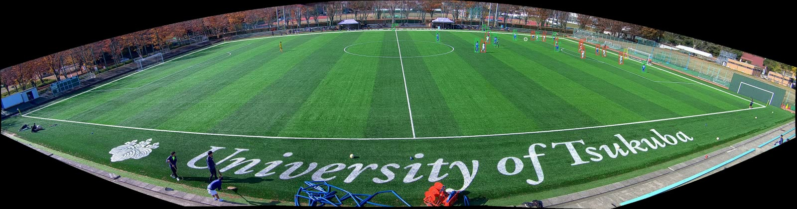

# Kimlik uzlaşısı: geliştirme ve üretim eşitliği

19 Eylül 2026. Varsayılan ByteTrack korunur. Yeni `--tracker consensus`
seçeneği ByteTrack gözlemlerini ve mevcut forma atamalarını korur; bağımsız
Deep OC-SORT + OSNet takibi yalnız kalıcı renk değişimini doğrulamak için
kullanılır. Ayrı kişileri birleştirmez, kutu silmez ve kimlik ayrımından sonra
takım renklerini yeniden öğrenmez. Henüz yeni kontrol sınavı tamamlanmadı;
bu seçenek deneysel, otomatik açılmıyor.

## Önce sistem gerçekten çalışıyor mu?

Başlangıç `0799aa5` üzerinde 2.905 uygulama testi geçti, 48 test atlandı;
ayrı gerçek CV ortamında 63 ilgili test geçti. Ardından 117093/3 numaralı
30 saniyelik klipte **RF-DETR de yeniden çalıştırıldı**. Torch/CUDA dedektör,
top ROI araması, OSNet ve Deep OC-SORT ile 375 örnekten 125 çıktı karesi
üretildi. Önizlemenin 125 karesi tamamen çözüldü ve görüntü incelendi.



Görüntü kaynağı: Atom Scott ve diğerleri, [SoccerTrack v2](https://atomscott.github.io/SoccerTrack-v2/),
[CC BY 4.0](https://github.com/AtomScott/SoccerTrack-v2/blob/main/LICENSE-DATA).
Görüntü ölçeklendi ve takip çizimleri eklendi.

Kayıtta 244 doğrudan, 34 ROI top gözlemi ve 87 tamamlanmış top konumu var.
9 pas adayı üretildi; bunlar doğrulanmış paslar değildir. 125 karedeki
2.996 oyuncu gözlemi geçici bellek SQLite veritabanına aktarıldı. Kimlik,
konum, top belirsizliği ve kamera sürekliliği korundu; tekrar ekleme olayları
çoğaltmadı. Kalıcı maç veritabanına yazılmadı.

Soğuk çalışma 268,3 saniye sürdü; model hazırlığı, dedektör ve video üretimi
dahildir. Bir bölümünde CPU uygulama testleri de çalışıyordu. Bu bir kararlı
performans kıyası değildir; 30 saniyeyi 30 saniyede işleme hedefi geçilmedi.
Kanıt: `measurements/tracking-system-validation-20260919.json`.

## Neden doğrudan yeni motoru seçmedik?

Parçalı kutu/üst-gövde geometrisine dayalı genel eşleştirme, iki bilinen gündüz
kopmasını elle kutu çıkarmadan korudu. Fakat tüm 11 kesitte forma sonuçlarını
geriletti ve bazı gece kişi çiftlerini yanlış birleştirdi. Yalnız yerel kutu
çatışmalarına uygulamak da bütün kabul koşullarını geçirmedi. Bu algoritmalar
üretim `consensus` profilinin parçası değildir.

Yeni motorun kimliklerini sonradan renk ile bölmek de yeterli olmadı.
ByteTrack'in mevcut gözlemlerini koruyup ayrımı ikinci motorla doğrulayan
kol ise eski doğru bağlantıları ve forma sonuçlarını korudu. Orijinal
Deep OC-SORT hareket kolu tek başına bu düzende ölçülen kişi kazanımını
sağlamadı; OSNet açık kol sağladı. Kararlar ve başarısız kollar:
`measurements/identity-consensus-development-ablation.json`.

## Kullanılan karar

1. ByteTrack ve orijinal Deep OC-SORT + OSNet aynı tespitlerin bağımsız
   kopyalarını işler. Yeni eşleştirme eşiği veya değiştirilmiş vendor kodu yoktur.
2. ByteTrack'in renk geçmişinde mevcut `appearance_phases` fonksiyonunun
   onayladığı değişim aranır: en az 5 geçmiş örneği, 32 örnek pencere,
   3 ardışık RGB ve renk oranı çelişkisi. Salt parlaklık değişimi yetmez.
3. Değişim öncesi son üç gözlemde ikinci motor aynı kimliği; değişim
   sırasında en az üç gözlemde sabit ve **farklı** bir kimliği vermelidir.
   Eksik veya kararsız destek ayrımı reddeder.
4. Ayrım, onaylanan değişimin ilk gözlemine uygulanır. Bu kesit içi geriye
   dönük onaydır; sıfır gecikmeli kare başına canlı kimlik iddiası değildir.
5. Her kaynak kutu, güven değeri ve o gözlemin eski takım ataması korunur.
   Yeni anonim kimlik, eski kimliğin takımını devralır. Bu değişiklik mevcut
   forma yanlışlarını çözmüş sayılmaz.

İkinci akışın kısa takip ve saha sınırı süzgeçleri de aynı üretim kurallarıyla
çalışır. İki motorun ID değerleri birbirleriyle eşitlenmez; karşılaştırma
kaynak kare/kutu üzerinden yapılır. Her motor ayrı sıfırlanır. Kamera/ışık/
diğer kimlik iyileştiricisi ile desteklenmeyen birleşimler reddedilir.

## Ölçülen kazanç ve sınırları

11 önceden görülmüş kesit, toplam 4.125 örnek kare kullanıldı. Bu verilerin
tamamı geliştirme verisidir; geçmiş kontrol adları yeni bağımsızlık sağlamaz.

| Gündüz başlangıç kişi ilişkileri | ByteTrack | Uzlaşı |
|---|---:|---:|
| Aynı kişi, doğru | 15/22 | 15/22 |
| Farklı kişi, doğru | 1/7 | 2/7 |
| Farklı kişiyi birleştirme | 6 | 5 |
| Çelişkili forma etiketleri taşıyan takip | 7 | 6 |

Gündüz üç ayrım üretildi; bunlardan biri mevcut etiketlerde bir yanlış
birleşmeyi düzeltti. Diğer iki ayrım bağımsız doğrulanmış başarı olarak
sayılmadı. Bütün eski doğru kişi çiftleri, gözlem kapsamı ve forma ölçümleri
korundu. Gece gruplarında yeni ayrım ve ölçülen kazanım yoktur.

Bu sonuç maç boyunca oyuncu tanıma, forma numarası, kadro eşleşmesi veya
IDF1/HOTA başarısı değildir. Kaynak görüntü hizaları ve ön eğitim bağımsızlığı
konusundaki önceki rapor sınırları sürer.

Tam sonuç: `measurements/identity-consensus-development-results.json`.

## Üretim ve eski davranışın korunması

`process_video` gerçek kaynak RGB görüntülerini çözüp iki takipçiyi ve OSNet'i
çalıştırdı; yalnız RF-DETR kişi kutuları değişmez önbellekten verildi.
11 kesitte kişi kutusu, kimlik, zaman ve yerel takım atamaları araştırma
adayına **birebir eşit**. Bu eşitlik çalışması top girişi içermedi.
Kanıt: `measurements/identity-consensus-production-parity.json`.

Ayrıca varsayılan yolun 22 eski çıktısı ve 164.772 kişi gözlemi yeniden
birebir üretildi. İlk dondurma ve iki eski entegrasyon belgesi değişmedi;
üçüncü sürüm ek belge yeni kod hash'lerini ve yeni eşitlik kanıtını bağlar.
Son kodda 83 gerçek CV testi ve 4 dondurma/kanıt zinciri testi geçti.
Entegrasyon sonrasında tam uygulama koşusu 2.926 başarılı, 51 atlanan test
verdi; ardından iki ek koruma testi eklendi ve ilgili CV kümesi tekrar geçti.
Ruff ve 545 dosyada mypy kontrolü geçti.

Video ve canlı CLI ortak seçiciyi kullanır:

```text
--tracker consensus --camera static --calibration <sabit-kamera.json>
```

OSNet kurulumu mevcut `TAKIP-REID-ENTEGRASYONU.md` tarifidir. Canlı renk çapasının
bağlamı yeni profil adını içerir; başka motorun kayıtlı durumuyla karışmaz.
Varsayılan motoru değiştirmeden önce adayın kodu ve kabul kuralları sabitlenip
önceden ayrılmış yeni görüntüler üzerinde değerlendirilmesi gerekir.

İzole çıktı aktarımı kontrolü:

```text
venv\Scripts\python.exe -m scripts.verify_tracking_payload --json <frames.json> --out <yeni-rapor.json>
```

Doğrulayıcı yalnız bellek SQLite kullanır, kalıcı veritabanını reddeder.

Yeni motor ayrıca önbelleksiz RF-DETR ve top ROI ile 30 saniyelik aynı gündüz
klibinde çalıştırıldı: 125 çıktı karesi, 2.944 oyuncu gözlemi, 8 pas adayı;
bellek veritabanına aktarım ve tekrar ekleme doğrulandı. Önizlemenin bütün
kareleri çözüldü. Süre 306,7 saniye; gerçek zaman hedefi henüz geçilmedi.
Bu sayıların ilk Deep OC-SORT koşusundan farkı farklı ana takip akışından
kaynaklanır; kimlik doğruluğu kazancı olarak sunulmaz. Kanıt ve çalıştırılan
kodun sınırları: `measurements/identity-consensus-detector-smoke.json`.

Son koruma aynı karede aynı kutunun birden çok görünmesi halinde belirsiz
ikinci motor desteğini reddeder. Son kodla 11 kesit üretim eşitliği tekrar
geçti. Yeni kontrol protokolü: `KIMLIK-UZLASISI-KONTROL-PLANI.md`.
